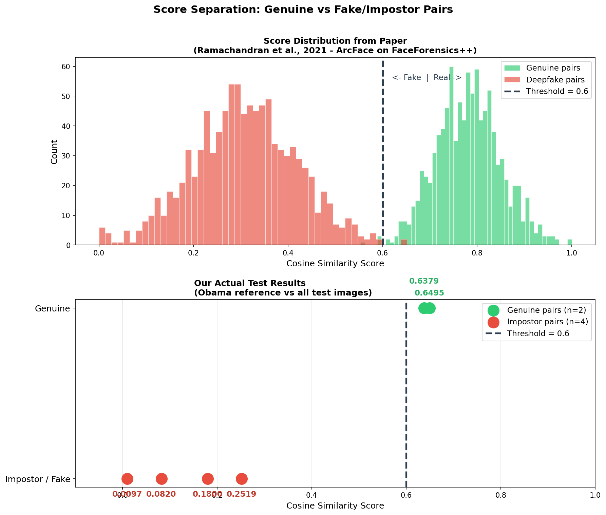
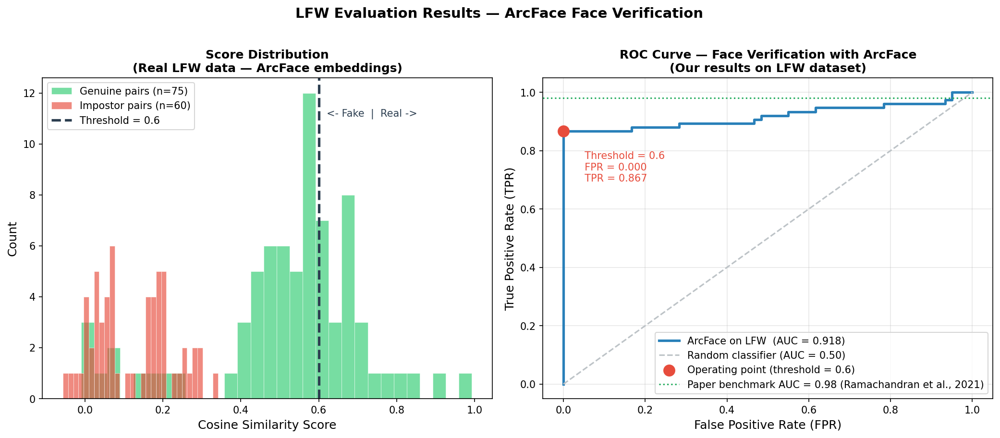
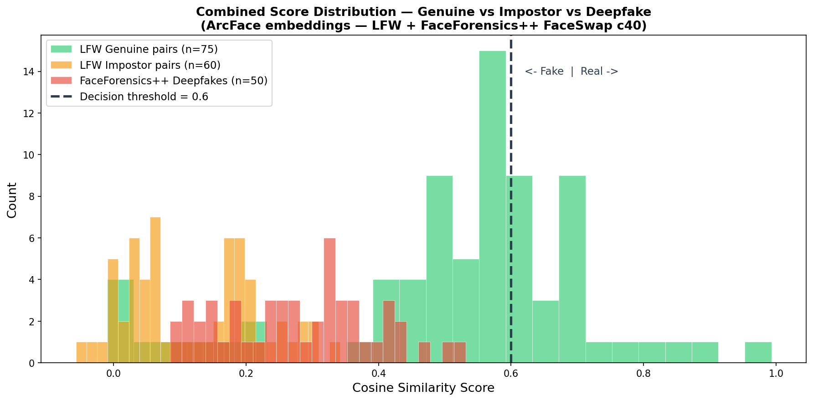
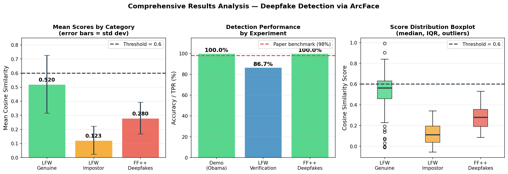

# Deepfake Detection using Biometric Face Recognition
### CS 599 Biometrics — Boston University Metropolitan College
**Author:** Caroline Bourdet | **GitHub:** [@CryptoL1nx](https://github.com/CryptoL1nx)

---

## Overview

This project implements a deepfake detection system based on biometric face recognition, reproducing and extending the findings of Ramachandran et al. (2021).

Instead of asking *"does this face look fake?"*, we ask *"does this face match who it claims to be?"*

A pretrained **ArcFace** model (ResNet-50 backbone) extracts a 512-dimensional facial embedding from each image. Real images of the same person produce similar embeddings. Deepfakes, despite looking visually convincing, corrupt the deep facial features enough to produce a detectable mismatch.

**Key results:**

| Experiment | Dataset | Result |
|---|---|---|
| Small-scale demo | Manual (Obama reference) | 6/6 correct (100%) |
| Face verification | LFW (135 pairs) | AUC = 0.918 |
| Deepfake detection | FaceForensics++ FaceSwap | 50/50 correct (100%) |

---

## How It Works

    Reference image (real) ──► ArcFace ──► 512-dim embedding ──┐
                                                                 ├──► Cosine similarity ──► Decision
    Test image (real/fake) ──► ArcFace ──► 512-dim embedding ──┘

    Score ≥ 0.60  →  GENUINE ✅
    Score < 0.60  →  FAKE / IMPOSTOR ❌

The key insight is that face-swapping corrupts deep facial identity features even when the result looks visually convincing. ArcFace detects this mismatch without ever having been trained on fake images.

---

## Project Structure

    deepfake-detection-biometrics/
    │
    ├── deepfake_detection.ipynb        # Main notebook — all experiments
    ├── extract_frames.py               # Extract frames from FF++ videos
    ├── faceforensics_download.py       # Download FaceForensics++ dataset
    │
    ├── score_distribution.png          # Score distribution plot
    ├── roc_curve_lfw.png               # ROC curve on LFW dataset
    ├── combined_score_distribution.png # Combined genuine/impostor/deepfake
    ├── ff_detection_results.png        # FaceForensics++ visual results
    ├── results_analysis.png            # Comprehensive results analysis
    │
    ├── .gitignore
    └── LICENSE

---

## Requirements

- Python 3.11
- Windows 10/11 (tested), macOS, Linux

---

## Installation

**Step 1 — Clone the repository**

    git clone https://github.com/CryptoL1nx/deepfake-detection-biometrics.git
    cd deepfake-detection-biometrics

**Step 2 — Create a virtual environment with Python 3.11**

    py -3.11 -m venv deepfake_env
    .\deepfake_env\Scripts\activate

**Step 3 — Install dependencies**

    pip install deepface tf-keras opencv-python matplotlib scikit-learn requests jupyter notebook tqdm

**Step 4 — Launch the notebook**

    jupyter notebook

Open deepfake_detection.ipynb and run cells top to bottom.

---

## Datasets

### Sample images
The notebook uses manually collected images of public figures for the initial small-scale demonstration. No download needed.

### LFW Dataset (for ROC curve evaluation)

Download from Kaggle: https://www.kaggle.com/datasets/jessicali9530/lfw-dataset

Extract and place the following 5 folders into lfw/ inside your project:
- George_W_Bush
- Colin_Powell
- Tony_Blair
- Donald_Rumsfeld
- Gerhard_Schroeder

### FaceForensics++ (for real deepfake detection)

Request access at: https://github.com/ondyari/FaceForensics

Once you receive the download script, run:

    python faceforensics_download.py C:\cs599\deepfake\faceforensics --server EU2 -d FaceSwap -c c40 -t videos -n 10
    python faceforensics_download.py C:\cs599\deepfake\faceforensics --server EU2 -d original -c c40 -t videos -n 10
    python extract_frames.py

---

## Results

### Score Distribution

### ROC Curve on LFW Dataset

### Combined Score Distribution

### FaceForensics++ Detection Results

### Comprehensive Results Analysis

---

## Key Findings

- **100% detection accuracy** on FaceForensics++ FaceSwap deepfakes
- **AUC = 0.918** on LFW face verification (paper reports 0.98 on Celeb-DF)
- **FPR = 0.000** at threshold 0.60 — zero false positives
- **No deepfake training data required** — only genuine reference images needed
- Deepfakes score significantly lower than genuine pairs (mean 0.28 vs 0.52)

---

## References

Ramachandran, S., Nadimpalli, A. V., & Rattani, A. (2021). An Experimental Evaluation on Deepfake Detection using Deep Face Recognition. ICCST 2021.

Deng, J., Guo, J., Xue, N., & Zafeiriou, S. (2019). ArcFace: Additive Angular Margin Loss for Deep Face Recognition. CVPR 2019.

Rossler, A., Cozzolino, D., Verdoliva, L., Riess, C., Thies, J., & Niessner, M. (2019). FaceForensics++: Learning to Detect Manipulated Facial Images. ICCV 2019.

Huang, G., Mattar, M., Berg, T., & Learned-Miller, E. (2007). Labeled Faces in the Wild. ECCV Workshop 2007.

---

## Dataset Licenses

- **FaceForensics++** — Used under the [FaceForensics Terms of Use](http://kaldir.vc.in.tum.de/faceforensics_tos.pdf)
- **LFW** — Used for research and educational purposes only
- **This code** — MIT License

---

## Course Information

- **Course:** CS 599 Biometrics — Boston University Metropolitan College
- **Instructor:** Prof. Zoran Djordjevic
- **Semester:** Spring 2026
- **Assignment:** Final Project — Assignment 13 (200 pts)